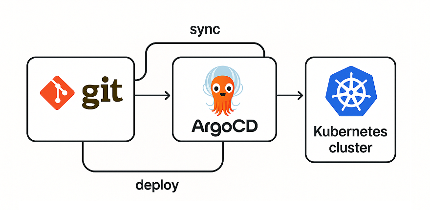

## Namespace & argoCD
- Maak de namespace aan: ```kubectl create namespace argocd```
- Installeer de ArgoCD: ```kubectl apply -n argocd -f https://raw.githubusercontent.com/argoproj/argo-cd/stable/manifests/install.yaml```
 
## Check status
- Wacht totdat de status van pods is **Running**: ```kubectl get po -n argocd -w```
- Dit hoeft eenmalig, maar voeg de cluster van argocd aan docker toe: ```argocd cluster add docker-desktop -y```

## Login
- Get admin password: ```kubectl -n argocd get secret argocd-initial-admin-secret -o jsonpath="{.data.password}" | base64 -d; echo ```
  - Alternatief is argocd CLI in mac: ```brew install argocd```, en daarna: ```argocd admin initial-password -n argocd```
- Voeg een port-forward service aan toe: ```kubectl apply -f argocd-service.yaml```
- Ga naar http://localhost:30080 in browser om in te logge als admin met het opgehaalde password

## Deploy APP
Je ziet nu de argoCD UI maar in Applications zie je nog niks. Hiervoor gaan we een app deployen
- App deployen via argocd: ```kubectl apply -f argocd-app.yaml -n argocd```
- check het in de browser: http://localhost:30081 en zie de ngnix-deployment draaien met de html uit de configmap

## GitOps :)
We gaan nu een change doen in techlab/techlab.yaml en die pushen naar github.
- Verander de versie in techlab/techlab.yaml (bv van 1.0.0 naar 1.0.1a) en de HTML in de configmap
  - Commit + push naar github
- Zie dat het in ArgoCD de app is automatisch updated
- Check de versie in shell: ```kubectl get deployment nginx-deployment -n argocd -o jsonpath="{.spec.template.spec.containers[?(@.name=='nginx')].env[?(@.name=='TAG')].value}"```